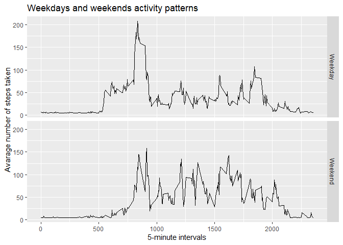

## Loading and preprocessing the data
1. The first step is to import the dataset from the downloaded file. 

```r
unzip("activity.zip")
raw_data <- read.csv("activity.csv", header = TRUE)
```

2. Then we have to transform it into something that is useful by removing the NAs from the file.

```r
clean_data <- na.omit(raw_data)
```

## What is mean total number of steps taken per day?
To calculate the number of steps taken per day we use the following code: 

USing the base plotting system we then produce a histogram 

<!-- -->
To derive the mean and median steps per day we use the following code:

```r
mean_steps <- mean(steps_per_day[,2])
print (mean_steps)
```

```
## [1] 10766.19
```

```r
median_steps <- median(steps_per_day[,2])
print (median_steps)
```

```
## [1] 10765
```

## What is the average daily activity pattern?

Section 2 starts by making a time plot of 5 minute intervals of daily activity: 
<!-- -->

finally we calculate which 5 minute interval has the highest amount of steps:

```r
interval_row <- which.max(averaged_day$x)
max_interval <- averaged_day[interval_row,1]
print (max_interval)
```

```
## [1] 835
```


## Imputing missing values
Section 3 requires the imputing of data,
1. First we must count the number of NA values that were in the raw datafile:

```r
NA_number <- length(which(is.na(raw_data$steps)))
print (NA_number)
```

```
## [1] 2304
```

2/3. Then we install the library HMisc and use its impute function to impute the calculated mean of the raw data to the NAs.

```r
library(Hmisc)
```

```
## Loading required package: lattice
```

```
## Loading required package: survival
```

```
## Loading required package: Formula
```

```
## Loading required package: ggplot2
```

```
## 
## Attaching package: 'Hmisc'
```

```
## The following objects are masked from 'package:base':
## 
##     format.pval, units
```

```r
raw_data_nona <- raw_data
raw_data_nona$steps <- impute(raw_data$steps, fun=mean)
steps_per_day_noNA <- aggregate(raw_data_nona$steps, 
                                by = list(Steps.Date = raw_data_nona$date), 
                                FUN = "sum")
```
4.creating a histogram of the imputed dataset and plotting as frequency:
<!-- -->
Calculating the new mean and median values  of the imputed data:

```r
mean_steps_noNA <- mean(steps_per_day_noNA[,2])
print (mean_steps_noNA)
```

```
## [1] 10766.19
```

```r
median_steps_noNA <- median(steps_per_day_noNA[,2])
print (median_steps_noNA)
```

```
## [1] 10766.19
```
## Are there differences in activity patterns between weekdays and weekends?
1. splitting the data by weekend or weekday


```r
raw_data_nona$date <- as.Date(raw_data_nona$date)
raw_data_nona$weekday <- weekdays(raw_data_nona$date)
raw_data_nona$day_type <- ifelse(raw_data_nona$weekday=="Saturday" |
                                     raw_data_nona$weekday=="Sunday","Weekend","Weekday")
raw_data_nona$day_type <- factor(raw_data_nona$day_type)


day_types_data <- aggregate(steps ~ interval + day_type, data=raw_data_nona, mean)
```

2. Making the plot
<!-- -->
